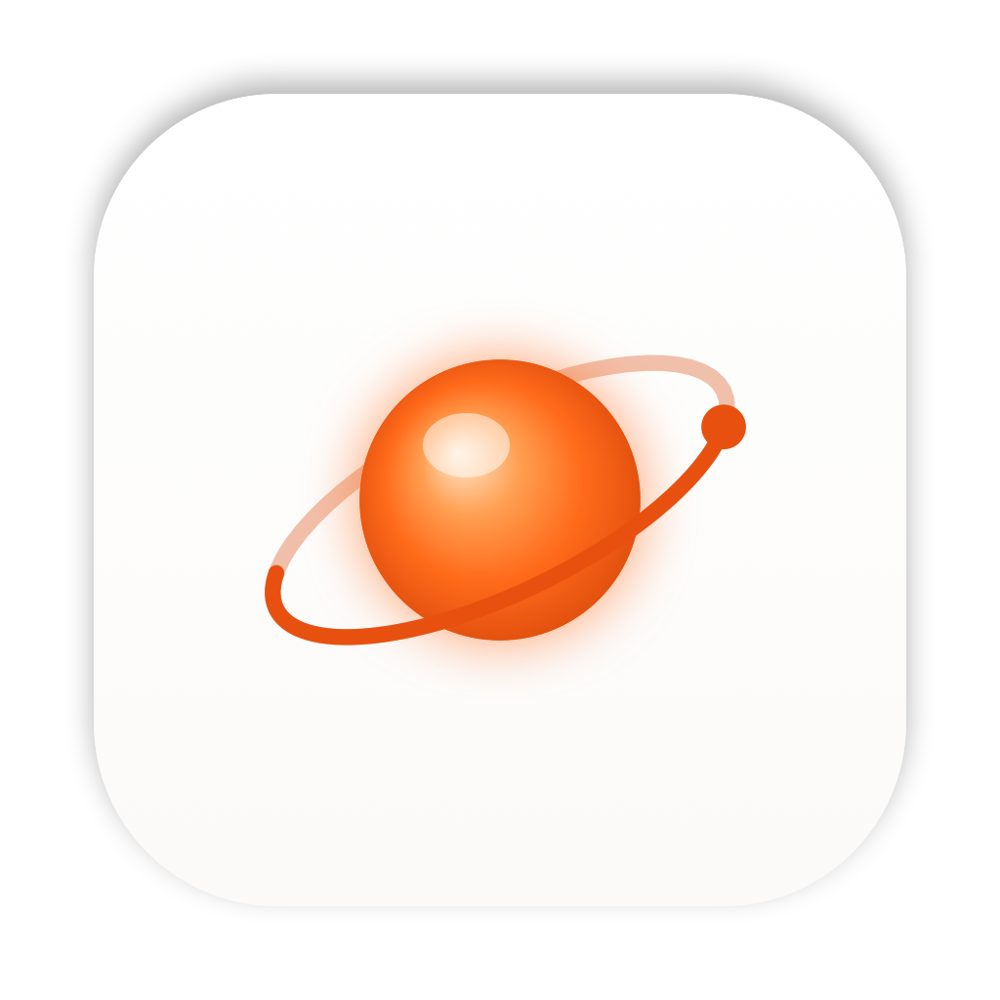

<div align="center">



# ORB

### A fully on-device voice agent for macOS that hears you, sees your screen, and operates your Mac.

[](https://www.apple.com/macos)
[](https://support.apple.com/en-us/116943)
[](https://swift.org)
[](https://developer.apple.com/xcode/swiftui/)
[](#privacy--security)
[](#roadmap)

Press a key, speak a command, and watch ORB plan and carry it out — opening apps,
clicking, typing, finding files and driving your Mac — **without a single byte
leaving the machine.**

</div>

---

## Table of Contents

- [What is ORB?](#what-is-orb)
- [Highlights](#highlights)
- [How It Works](#how-it-works)
- [The Models](#the-models)
- [What ORB Can Do](#what-orb-can-do)
- [Requirements](#requirements)
- [Getting Started](#getting-started)
- [Permissions](#permissions)
- [Usage](#usage)
- [Configuration](#configuration)
- [Privacy & Security](#privacy--security)
- [Architecture](#architecture)
- [Project Structure](#project-structure)
- [Tech Stack](#tech-stack)
- [Roadmap](#roadmap)
- [Contributing](#contributing)
- [License](#license)
- [Acknowledgements](#acknowledgements)

---

## What is ORB?

**ORB** is a native macOS menu-bar assistant that turns natural speech into real
actions on your computer. It listens through your microphone, transcribes your
words on-device, takes a screenshot so it can *see* what you see, reasons about
your intent with a local vision-language model, and then executes a concrete plan
of UI actions — launching apps, clicking, typing, running keyboard shortcuts,
searching for files, adjusting volume and more.

Unlike cloud assistants, **ORB performs every step locally.** Speech recognition,
visual reasoning and action planning all run on Apple Silicon using
[ONNX Runtime](https://onnxruntime.ai) and Apple's [MLX](https://github.com/ml-explore/mlx).
Your voice is never recorded to disk, never uploaded, and no network connection is
touched at inference time.

ORB lives quietly in the menu bar (it's an `LSUIElement` agent app), surfaces a
focused popover while it works, and paints a soft **glow border** around your
screen so you always know which phase it's in — listening, planning or executing.

---

## Highlights

- 🎙️ **On-device speech-to-text** — streaming transcription with Moonshine on ONNX Runtime, with live partial results and automatic silence detection.
- 👁️ **Vision + intent reasoning** — Gemma 4 E4B (4-bit) on MLX reads your screenshot and turns "*open Safari and search for the weather*" into a structured, executable action plan.
- 🤖 **Real automation** — ORB doesn't just transcribe; it drives the Mac: opening/quitting apps, clicking, typing, keyboard shortcuts, scrolling, file search, URLs, volume and screenshots.
- ✅ **Self-verifying execution** — each `verify` step is visually checked against a fresh screenshot, with automatic retries on failure.
- 🔒 **Private by design** — 100% local inference, no telemetry, no cloud, no audio retention.
- ⚡ **Global hotkey** — summon ORB from anywhere with **⌘L** (rebindable) and start talking instantly.
- 🌈 **Ambient glow overlay** — a non-intrusive screen-edge glow reflects the agent's state in real time.
- ⏯️ **Pausable model downloads** — both models download with a resumable, independently pausable downloader into a single relocatable folder.
- 📊 **Live dashboard** — model readiness, RAM footprint and throughput (tok/s, ms latency) at a glance, plus a full command history.
- 🧠 **Memory-aware** — a low-memory guard pauses execution before the system is starved, and Gemma stays resident between commands for responsiveness.

---

## How It Works

ORB runs a five-stage **voice → intent → action** pipeline:

```
  ┌──────────┐   ┌───────────────┐   ┌────────────────┐   ┌──────────────┐   ┌──────────┐
  │  LISTEN  │ → │   TRANSCRIBE  │ → │      PLAN      │ → │   EXECUTE    │ → │  RESULT  │
  │  ⌘L /    │   │  Moonshine    │   │  Gemma 4 E4B   │   │  Action      │   │  notify  │
  │  tap orb │   │  (ONNX, 16kHz)│   │  (MLX + vision)│   │  Executor    │   │  + glow  │
  └──────────┘   └───────────────┘   └────────────────┘   └──────────────┘   └──────────┘
       │                │                    │                    │                 │
   mic capture     streaming STT      screenshot + intent    atomic actions    history +
   + silence       w/ live partials   → JSON action plan     + retries +       banner /
   detection                                                 visual verify     speech
```

1. **Listen.** Triggered by the global hotkey or a tap on the orb, ORB captures
   16 kHz audio and watches for silence to know when you're done (with a safety
   cap so capture never hangs).
2. **Transcribe.** Audio is streamed through **Moonshine Base** on ONNX Runtime —
   encoder → decoder with a name-threaded KV-cache — producing live partial text
   and a final transcript.
3. **Plan.** ORB captures a screenshot and asks **Gemma 4 E4B** (running on MLX)
   to read the screen and the transcript and emit a structured JSON action plan
   (a summary, a target app, and an ordered list of atomic actions).
4. **Execute.** The `ActionExecutor` runs each action in order against real
   automation primitives, applying configurable delays, retrying on failure, and
   visually verifying `verify` steps against a fresh screenshot.
5. **Result.** Success or failure is recorded to history, announced with an
   optional banner/spoken summary, and flashed via the glow border.

If the vision model is unavailable or its output can't be parsed, ORB gracefully
falls back to a deterministic rule-based planner so common commands still work.

---

## The Models

Both models are downloaded on first run via ORB's own pausable `URLSession`
downloader — real progress, resumable, independently pausable — into a single,
user-relocatable folder. Models load from that local folder; **no network is
touched at inference time.**

| Role | Model | Repository | Runtime | Purpose |
|------|-------|-----------|---------|---------|
| Speech-to-text | **Moonshine Base** | [`onnx-community/moonshine-base-ONNX`](https://huggingface.co/onnx-community/moonshine-base-ONNX) | ONNX Runtime | Streaming 16 kHz transcription with live partials |
| Vision + intent | **Gemma 4 E4B** (4-bit) | [`mlx-community/gemma-4-e4b-it-4bit`](https://huggingface.co/mlx-community/gemma-4-e4b-it-4bit) | Apple MLX (VLM) | Reads the screen, extracts intent, plans & verifies actions |

The dashboard reports each model's readiness, resident RAM, and live performance
metrics (tokens/second for Gemma, milliseconds for Moonshine).

---

## What ORB Can Do

ORB's planner composes commands from a set of atomic action primitives:

| Action | Description |
|--------|-------------|
| `openApp` / `quitApp` | Launch or quit an application |
| `click` | Click a UI element or coordinate |
| `type` | Type text into the focused field |
| `keyShortcut` | Press a keyboard shortcut (e.g. ⌘C) |
| `scroll` | Scroll the active view |
| `findFile` | Search the file system for a file |
| `openURL` | Open a URL in the default browser |
| `setVolume` | Set the system output volume |
| `screenshot` | Capture the screen |
| `wait` | Pause between steps |
| `verify` | Visually confirm a step succeeded (Gemma) |

**Example commands**

> "Open Safari and go to apple.com"
>
> "Find my resume PDF"
>
> "Turn the volume down"
>
> "Take a screenshot"
>
> "Quit Spotify"

---

## Requirements

- **macOS 14.0 (Sonoma) or later**
- **Apple Silicon** (M-series) — required by MLX for on-device inference
- **Xcode 15+** to build from source
- A few GB of free disk space and RAM for the local models

---

## Getting Started

### Build from source

```bash
# 1. Clone
git clone https://github.com/settylokesh/ORB.git
cd ORB

# 2. Open in Xcode
open ORB.xcodeproj

# 3. Select the "ORB" scheme and an Apple-Silicon "My Mac" destination,
#    then Build & Run (⌘R).
```

Swift Package Manager dependencies are resolved automatically by Xcode on first
open:

- [`mlx-swift-lm`](https://github.com/ml-explore/mlx-swift-lm) — MLX language/vision model runtime
- [`onnxruntime-swift-package-manager`](https://github.com/microsoft/onnxruntime-swift-package-manager) — ONNX Runtime for Moonshine
- [`swift-transformers`](https://github.com/huggingface/swift-transformers) — tokenizers & model utilities
- [`swift-huggingface`](https://github.com/huggingface/swift-huggingface) — Hugging Face Hub integration

### First launch

On first launch ORB walks you through a short **onboarding** flow to download the
models and grant permissions. After that it goes straight to the dashboard — you
can manage models and permissions there at any time.

---

## Permissions

ORB needs a few macOS permissions to see and operate your Mac. You'll be prompted
on first use; you can also manage them from the **Permissions** tab.

| Permission | Why ORB needs it |
|------------|------------------|
| **Microphone** | To hear your spoken commands (transcribed on-device; audio is never recorded or uploaded) |
| **Accessibility** | To control apps, click, type and run shortcuts on your behalf |
| **Screen Recording** | So the vision model can *see* the UI to plan and verify actions |
| **Automation (Apple Events)** | To drive apps to carry out your commands |

---

## Usage

1. Press **⌘L** (or click the orb in the menu bar) to start listening.
2. Speak your command. ORB shows live transcription and stops automatically when
   you go quiet.
3. ORB plans the steps (optionally asking you to confirm), then executes them,
   showing each step's status live.
4. You get a success/failure result with an optional banner and spoken summary —
   and it's saved to your **History**.

Press the hotkey again while listening to finish immediately, or cancel at any
time. Use **Repeat last** to re-run your previous command.

---

## Configuration

All settings live in the **Settings** tab and persist across launches:

| Setting | Description |
|---------|-------------|
| **Global hotkey** | The shortcut that summons ORB (default **⌘L**) |
| **Launch at login** | Start ORB automatically when you log in |
| **Show Dock icon** | Run as a pure menu-bar agent or also show in the Dock |
| **Theme** | Appearance theme |
| **Silence timeout** | How long of a pause ends listening |
| **Action delay** | Delay inserted between executed actions |
| **Max retries** | How many times to retry a failing action |
| **Confirm before executing** | Show a confirmation dialog before running a plan |
| **Show glow border** | Toggle the ambient screen-edge glow |
| **Speak result** | Speak the outcome aloud |
| **Banner notifications** | Post a notification on completion |
| **Sound on completion** | Play a sound when a command finishes |
| **Models folder** | Relocatable folder where models are stored |

---

## Privacy & Security

ORB is built **private-first**:

- **100% on-device inference.** Speech recognition (ONNX Runtime) and vision/intent
  reasoning (MLX) run entirely on your Mac.
- **No audio retention.** Your microphone audio is transcribed in-memory and never
  written to disk or uploaded.
- **No inference-time network.** Models are loaded from a local folder; the only
  network use is the one-time model download.
- **No telemetry.** ORB doesn't phone home.
- **You're in control.** Optional confirmation gating, configurable retries, a
  cancel control, and explicit, revocable system permissions.

> ORB controls your Mac on your behalf. Review the **Confirm before executing**
> setting if you'd like to approve every plan before it runs.

---

## Architecture

ORB uses a single shared `AppState` store/orchestrator that drives the menu-bar
icon, popover, main window and glow overlay, and runs the pipeline. Windows are
managed in AppKit via an `AppDelegate`; the only SwiftUI scene is an (empty)
`Settings` scene, keeping ORB a true agent app.

- **Core** — `AppState` (orchestration), `StatusBarController`, `WindowManager`,
  `GlobalHotkeyManager`.
- **Voice** — `AudioCaptureEngine`, `SilenceDetector`, `MoonshineSTT` +
  `MoonshineTokenizer` (ONNX streaming STT).
- **AI** — `MLXGemmaEngine` (vision + intent + verification), `ActionPlanner`
  (rule-based fallback), `ModelManager` + `ModelDownloader` (pausable downloads).
- **Automation** — `ActionExecutor` plus primitives: `AppLauncher`,
  `KeyboardController`, `MouseController`, `ScreenReader`, `FileSearchEngine`,
  `SystemActions`.
- **UI** — Menu-bar popover state views (listening / executing / result), main
  window tabs (Dashboard, History, Settings, Permissions), Onboarding, and the
  `OrbView`/`Theme` design system.
- **Overlay** — `GlowBorder` window/controller/view for the ambient screen glow.
- **Storage & Utilities** — `HistoryStore`, `SettingsStore`, `PermissionsManager`,
  `RAMManager`, `NotificationManager`, `LoginItem`.

---

## Project Structure

```
ORB/
├── ORBApp.swift              # @main entry (agent app; empty Settings scene)
├── App/                      # AppDelegate — wires hotkey, status bar, windows, glow
├── Core/                     # AppState orchestrator, status bar, windows, hotkey
├── Voice/                    # Audio capture, silence detection, Moonshine STT
├── AI/                       # MLX Gemma engine, planner, model manager + downloader
├── Automation/               # ActionExecutor + app/keyboard/mouse/screen/file/system
├── Overlay/                  # Glow border window, controller, view
├── MenuBar/                  # Popover + listening / executing / result state views
├── MainWindow/               # Dashboard, History, Settings, Permissions
├── Onboarding/               # First-run setup flow
├── Design/                   # OrbView + Theme design system
├── Models/                   # Shared value types (AgentState, actions, intents…)
├── Storage/                  # History & settings persistence
└── Utilities/                # Permissions, RAM, notifications, login item, extensions
```

---

## Tech Stack

- **Language:** Swift 5
- **UI:** SwiftUI + AppKit (menu-bar `LSUIElement` agent app)
- **Speech-to-text:** Moonshine Base via ONNX Runtime
- **Vision + reasoning:** Gemma 4 E4B (4-bit) via Apple MLX
- **Concurrency:** Swift Concurrency (`async`/`await`, task groups, timeouts)
- **Min target:** macOS 14.0 · Apple Silicon

---

## Roadmap

- [ ] Additional STT and LLM model options
- [ ] Richer multi-step automations and app-specific skills
- [ ] User-defined command shortcuts / macros
- [ ] Expanded accessibility-tree targeting for more reliable clicks
- [ ] Localization

---

## Contributing

Contributions are welcome! If you'd like to help:

1. Fork the repository and create a feature branch.
2. Make your change with clear, focused commits.
3. Open a pull request describing the motivation and approach.

For larger changes, please open an issue first to discuss the direction.

---

## License

This project does not yet specify an open-source license. Until a `LICENSE` file
is added, all rights are reserved by the author.

© 2026 Lokesh Setty.

---

## Acknowledgements

- [Moonshine](https://huggingface.co/onnx-community/moonshine-base-ONNX) — fast on-device speech recognition
- [Gemma](https://huggingface.co/mlx-community/gemma-4-e4b-it-4bit) — open vision-language model
- [Apple MLX](https://github.com/ml-explore/mlx) and [mlx-swift-lm](https://github.com/ml-explore/mlx-swift-lm)
- [ONNX Runtime](https://onnxruntime.ai)
- [Hugging Face](https://huggingface.co) `swift-transformers` & `swift-huggingface`

<br />

<div align="center">


**ORB** — your Mac, by voice. On-device. Private. Yours.

<sub>Built with Swift, MLX & ONNX Runtime · © 2026 Lokesh Setty</sub>

</div>
